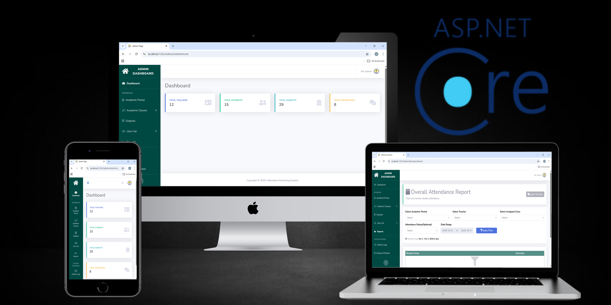

# 📋 School Attendance Monitoring System

Welcome to my **School Attendance Monitoring System**, a web-based system built using **ASP.NET Core MVC (.Net 8)**. Designed for Mayor Cesario A. Pimentel National Highschool to efficiently track student attedance and generate reports with role-baed access for Admin, Teacher and Secretaries.

# ✨ Features
🔐 **Authorization & Authentication**
- Secure login system with role-based access control
- Three user roles: Admin, Teacher and Secretary
- Each role has scoped permission and views

🛡️ **Admin**

- Manage user accounts (create, update, assign, soft deletion)
- Set and manage academic period
- Manage academic records: Sections and Subjects
- Assign Teacher and secretary to their designated classes
- View all student attendance records
- Export attendance reports to Excel(.xlsx)

📝 **Teacher**

- Manage and view assigned class and its students
- Manage and view assigned secretaries
- View all student attendance records based on assigned class
- Export attendance reports to Excel(.xlsx)

🎓 **Secretary**

- View and manage student attendance

# 👨‍💻 Tech Stack

- ASP.NET Core MVC(.Net 8)
- C# 
- Entity Framework Core ORM
- SQL Server/LocalDB
- SB-Admin-2
- Bootstrap 4
- Razor
- HTML
- CSS
- JavaScript
- JQuery
  

# ⚙️ Getting Started
## Prerequisites

Make sure you have the following installed:

- [Visual Studio 2022](https://visualstudio.microsoft.com/)
- [.NET 8 SDK](https://dotnet.microsoft.com/download/dotnet/8.0)
- [SQL Server](https://www.microsoft.com/en-us/sql-server) or SQL Server Express / LocalDB
    
### Run the project: Visual Studio

1. Open the project using Visual Studio
2. Update the connecton string in appsettings.json to match your SQL Server database:
    ```json
    "ConnectionStrings": {
        "DefaultConnection": "Server=(localdb)\\mssqllocaldb;Database=AttendanceDb;Trusted_Connection=True;"
    }
    ```
3. Clean and build the solution:

        • Right-click the solution > Clean
        • Right-click the solution > Build 

4. Apply database migrations — open **Package Manager Console** and run:
    ```
    Update-Database
    ```

5. Run the project:
        
        • Click the green "play" button in the Visual Studio toolbar.

### Run the project: IIS Web Server

For deployment to IIS:

1. **Publish the project**

- Right-click the project > Publish
- Choose a folder to output the files

2. **Deploy to IIS:**

- Copy the published files to your IIS directory.
- Configure IIS to point to the folder and ensure database connectivity.

## 👤 Default Accounts

**Admin**

- **Id/Username**: 12345
- **Password**: admin123

# 🙏 Acknowledgments

- [SB Admin 2](https://startbootstrap.com/theme/sb-admin-2) — Bootstrap admin template used for the frontend UI
- [EPPlus](https://epplussoftware.com/) — Excel report generation
- [ASP.NET Core Identity](https://docs.microsoft.com/en-us/aspnet/core/security/authentication/identity) — Authentication & role management

Thanks to these projects for their contributions to the developer community.


# 🤝 Contributing
This is a personal portfolio project. Feedback and suggestions are welcome! Feel free to open an issue or fork the repo.

# 📄 License
This project is licensed under the [MIT License](LICENSE).


# Author
**Michael Angelo D. Pimentel**

- GitHub: @Gelo-Dev18
- LinkedIn: linkedin.com/in/michaelangelopimentel18 
- Gmail: michaelangelopimentel18@gmail.com


*Built as a portfolio project to demonstrate ASP.NET Core MVC, Entity Framework Core, and role-based authentication in a real-world academic use case.*


